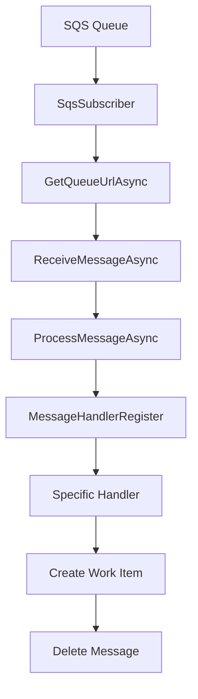

# Orchestrator SQS Functionality Documentation

## Overview

The FCC SEU Orchestrator implements a comprehensive Amazon SQS (Simple Queue Service) messaging system that enables asynchronous communication and work item management. The SQS integration consists of three main components: message subscriptions, message publishing, and message processing handlers. This system allows the orchestrator to receive work requests, process them asynchronously, and publish work items for downstream consumers.

## Architecture Components

### 1. SQS Subscription System (`Orchestrator.SQS.Subscriptions`)

The subscription system continuously polls AWS SQS queues for incoming messages and routes them to appropriate handlers based on message type.

#### Key Components

- **SqsSubscriber**: Background service that polls SQS queues
- **MessageHandlerRegister**: Registry that maps message types to handler implementations
- **SqsMessage**: Message structure for SQS/SNS integration
- **IMessageHandler**: Interface for message processing implementations

### 2. SQS Commands (`Orchestrator.SQS.Commands`)

Message handlers that process specific types of work requests and convert them into orchestrator work items.

#### Message Types Supported

1. **Worker Manifest Discovery** (`fccseu-schedule-worker-manifest-discovery-v1`)
2. **Schedule Update** (`fccseu-managed-software-component-schedule-update-v1`)
3. **Schedule Rollback** (`fccseu-managed-software-component-schedule-rollback-v1`)

### 3. SQS Publishers (`Orchestrator.SQS.Publishers`)

Publishing system for sending messages to SNS topics and SQS queues for downstream processing.

## Queue Configuration

### Primary Queues

- **Main Event Queue**: `fccseu-orchestrator-event-queue`
- **Dead Letter Queue**: `fccseu-orchestrator-event-deadletter-queue`

### Queue Settings

- **Long Polling**: 20-second wait time for efficient message retrieval
- **Message Attributes**: All attributes retrieved for message routing
- **Visibility Timeout**: Standard SQS configuration
- **Dead Letter Queue**: Failed messages routed to dead letter queue

## Message Processing Flow

### 1. Message Reception



### 2. Message Structure

#### SqsMessage Format
```json
{
  "Type": "Notification",
  "MessageId": "guid",
  "TopicArn": "arn:aws:sns:...",
  "Message": "serialized-payload",
  "Timestamp": "ISO-8601-timestamp",
  "SignatureVersion": "1",
  "Signature": "verification-signature",
  "SigningCertURL": "certificate-url",
  "UnsubscribeURL": "unsubscribe-url",
  "MessageAttributes": {
    "type": {
      "Type": "String",
      "Value": "message-type-identifier"
    },
    "_datadog": {
      "Type": "Binary",
      "Value": "base64-encoded-trace-data"
    }
  }
}
```

## Message Handlers

### 1. DiscoverManifestMessageHandler

**Purpose**: Processes worker discovery requests to identify available workers in an environment.

**Message Format**:
```json
{
  "schema": "schema-version",
  "brokerId": "broker-identifier",
  "environmentId": "environment-guid",
  "appKey": "application-key",
  "eventId": "event-guid",
  "workers": ["worker1", "worker2", "worker3"]
}
```

**Processing**:
- Deserializes `DiscoverManifestMessage`
- Validates message data and string lengths
- Creates `CreateDiscoverManifestWorkItemCommand`
- Converts to work item with type `fccseu-schedule-worker-manifest-discovery-v1`
- Stores worker list in work data as JSON

### 2. ScheduleUpdateHandler

**Purpose**: Processes software component update scheduling requests.

**Message Format**:
```json
{
  "environmentId": "environment-guid",
  "appKey": "application-key",
  "brokerId": "broker-identifier",
  "workerId": "worker-identifier",
  "managedComponentId": "component-identifier",
  "artifactId": "artifact-identifier",
  "eventId": "event-guid"
}
```

**Processing**:
- Deserializes `ScheduleUpdateMessage`
- Validates required fields and string length constraints
- Creates `CreateWorkItemCommand`
- Converts to work item with type `fccseu-managed-software-component-schedule-update-v1`
- Stores worker, component, and artifact IDs in work data

### 3. RollbackUpdateHandler

**Purpose**: Processes software component rollback scheduling requests.

**Message Format**:
```json
{
  "environmentId": "environment-guid",
  "appKey": "application-key",
  "brokerId": "broker-identifier",
  "workerId": "worker-identifier",
  "managedComponentId": "component-identifier",
  "rollbackPackageId": "rollback-package-identifier",
  "eventId": "event-guid"
}
```

**Processing**:
- Deserializes `RollbackUpdateMessage`
- Validates message data and constraints
- Creates `CreateWorkItemCommand`
- Converts to work item with type `fccseu-managed-software-component-schedule-rollback-v1`
- Stores worker, component, and rollback package IDs in work data

## SQS Subscriber Implementation

### Core Background Service

The `SqsSubscriber` class implements the `BackgroundService` pattern and continuously polls the SQS queue:

```csharp
public class SqsSubscriber : BackgroundService
{
    private readonly IAmazonSQS _sqsClient;
    private readonly TargetAwsAccountId _targetAccount;
    private readonly ILogger _logger;
    private readonly MessageHandlerRegister _registry;
    private readonly IServiceProvider _serviceProvider;
    private readonly ITracer _tracer;
}
```

### Polling Process

1. **Queue URL Resolution**: Resolves queue URL using account ID and queue name
2. **Continuous Polling**: Long-polling with 20-second wait times
3. **Message Processing**: Deserializes and routes messages to appropriate handlers
4. **Error Handling**: Logs errors and continues processing
5. **Message Deletion**: Removes successfully processed messages from queue

### Distributed Tracing Integration

The system integrates with Datadog for distributed tracing:

- Extracts trace IDs and span IDs from message attributes
- Creates OpenTelemetry spans for message processing
- Propagates trace context through the processing pipeline
- Supports debugging and performance monitoring

## Message Handler Registration

### Registration Process

Message handlers are registered using the `MessageHandlerRegisterBuilder`:

```csharp
public static void RegisterOrchestratorManagementMessageHandlers(
    this MessageHandlerRegisterBuilder register)
{
    register.RegisterHandler<DiscoverManifestMessageHandler>(
        MessageTypeConstants.FCCSEU_SCHEDULE_WORKER_MANIFEST_DISCOVERY_V1);
    register.RegisterHandler<ScheduleUpdateHandler>(
        MessageTypeConstants.FCCSEU_MANAGED_SOFTWARE_COMPONENT_SCHEDULE_UPDATE_V1);
    register.RegisterHandler<RollbackUpdateHandler>(
        MessageTypeConstants.FCCSEU_MANAGED_SOFTWARE_COMPONENT_SCHEDULE_ROLLBACK_V1);
}
```

### Handler Resolution

1. Extract message type from message attributes
2. Look up handler type in registry
3. Create scoped service instance
4. Execute handler with message payload
5. Handle exceptions and logging

## Message Validation

### Data Validation Rules

All message handlers implement comprehensive validation:

#### String Length Constraints
- `BrokerId`: Maximum 64 characters
- `WorkerId`: Maximum 64 characters
- `ManagedComponentId`: Maximum 255 characters
- `ArtifactId`: Maximum 255 characters
- `RollbackPackageId`: Maximum 255 characters

#### Required Fields
- All message types require `BrokerId`, `EnvironmentId`, `EventId`
- Update messages require `WorkerId`, `ManagedComponentId`
- Rollback messages require `RollbackPackageId`
- Discovery messages require `Workers` list

#### Validation Process
1. Deserialize message from JSON
2. Trim all string properties
3. Validate using data annotations
4. Throw `ValidationException` for invalid data
5. Set trace parent ID for correlation

## Work Item Creation

### Work Item Structure

All SQS message handlers convert messages to `WorkItemWrite` objects:

```csharp
public class WorkItemWrite
{
    public string BrokerId { get; set; }
    public Guid EventId { get; set; }
    public Guid HxEnvironmentId { get; set; }
    public string HxAppKey { get; set; }
    public string TypeName { get; set; }
    public int Status { get; set; } // WorkItemState enum
    public string? TraceParentId { get; set; }
    public string? WorkData { get; set; } // JSON payload
    public string? Schema { get; set; }
}
```

### Work Data Serialization

Each message type creates specific work data JSON:

#### Discovery Messages
```json
{
  "workers": ["worker1", "worker2", "worker3"]
}
```

#### Update Messages
```json
{
  "workerId": "worker-id",
  "managedComponentId": "component-id",
  "artifactId": "artifact-id"
}
```

#### Rollback Messages
```json
{
  "workerId": "worker-id",
  "managedComponentId": "component-id",
  "rollbackPackageId": "rollback-package-id"
}
```

## Error Handling

### Exception Types

1. **Deserialization Errors**: Invalid JSON format
2. **Validation Errors**: Data constraint violations
3. **Handler Resolution Errors**: Missing service registrations
4. **Processing Errors**: Database or business logic failures

### Error Handling Strategy

1. **Message Level**: Individual message errors are logged and message is deleted
2. **Queue Level**: Queue connection errors stop processing temporarily
3. **Handler Level**: Handler exceptions are caught and logged
4. **Retry Strategy**: Failed messages can be reprocessed from dead letter queue

### Logging and Monitoring

- Structured logging with Serilog
- Distributed tracing with OpenTelemetry
- Error metrics and alerting
- Dead letter queue monitoring

## Configuration

### Service Registration

```csharp
services.AddHostedSubscriber(register =>
{
    register.RegisterOrchestratorManagementMessageHandlers();
});
```

### AWS Configuration

- AWS SDK configuration for SQS client
- Target AWS account ID configuration
- IAM permissions for queue access
- Dead letter queue configuration

### Environment Variables

- `AWS_REGION`: AWS region for SQS operations
- `TARGET_AWS_ACCOUNT_ID`: Account ID for queue resolution
- Connection strings and logging configuration

## Performance Considerations

### Throughput Optimization

1. **Long Polling**: Reduces API calls and improves responsiveness
2. **Parallel Processing**: Multiple messages processed concurrently
3. **Scoped Services**: Efficient service resolution per message
4. **Connection Pooling**: Reused SQS client connections

### Resource Management

1. **Background Service**: Runs as hosted service in ASP.NET Core
2. **Cancellation Tokens**: Graceful shutdown support
3. **Service Scoping**: Proper disposal of scoped dependencies
4. **Memory Management**: Efficient message processing pipeline

## Testing Strategy

### Unit Tests

1. **Handler Tests**: Mock dependencies and test message processing
2. **Validation Tests**: Test data validation rules
3. **Serialization Tests**: Test message format compatibility
4. **Error Handling Tests**: Test exception scenarios

### Integration Tests

1. **SQS Integration**: Test with local SQS or mocked AWS services
2. **End-to-End Tests**: Full message processing pipeline
3. **Database Integration**: Work item creation verification
4. **Performance Tests**: Load testing and throughput measurement

## Security Considerations

### AWS Security

1. **IAM Permissions**: Least privilege access to SQS queues
2. **Message Encryption**: SQS server-side encryption
3. **VPC Configuration**: Network isolation for queue access
4. **Access Logging**: CloudTrail logging for audit trails

### Message Security

1. **Message Validation**: Strict input validation
2. **Content Filtering**: Sanitization of message content
3. **Authentication**: Verify message source authenticity
4. **Authorization**: Environment-based access control

## Deployment Considerations

### Infrastructure Requirements

1. **SQS Queues**: Main queue and dead letter queue
2. **IAM Roles**: Service roles with appropriate permissions
3. **Monitoring**: CloudWatch metrics and alarms
4. **Networking**: VPC configuration for secure access

### High Availability

1. **Multi-AZ Deployment**: SQS queues replicated across availability zones
2. **Auto Scaling**: Service instances scale based on queue depth
3. **Health Checks**: Service health monitoring and restart
4. **Circuit Breakers**: Fail-fast mechanisms for downstream dependencies

## Troubleshooting Guide

### Common Issues

1. **Message Processing Failures**: Check handler logs and validation errors
2. **Queue Access Issues**: Verify IAM permissions and network connectivity
3. **Dead Letter Queue Buildup**: Investigate message format or processing errors
4. **Performance Issues**: Monitor queue depth and processing times

### Debugging Tools

1. **Logging**: Structured logs with correlation IDs
2. **Tracing**: Distributed tracing for request flow
3. **Metrics**: Queue depth, processing time, error rates
4. **AWS Console**: SQS queue monitoring and message inspection

This SQS functionality provides a robust, scalable messaging system that enables the FCC SEU Orchestrator to handle asynchronous work item creation and processing while maintaining high availability and performance standards.
